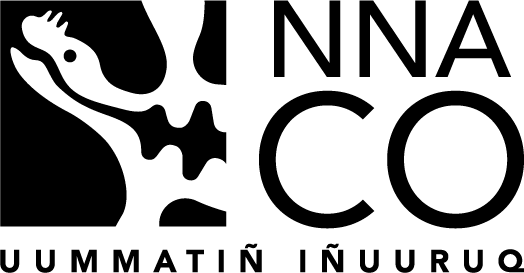

# Navigating the New Arctic Community Office

Navigating the New Arctic (NNA) is one of NSF's 10 Big Ideas. NNA projects address challenges in the rapidly changing Arctic using convergence research. 
NNA aims to empower new research partnerships from local to international scales, diversify the next generation of Arctic researchers, enhance efforts 
in formal and informal education, and integrate the co-production of knowledge where appropriate.

The Navigating the New Arctic Community Office (NNA-CO) fulfills part of this mission by building awareness, partnerships, opportunities, and resources 
for collaboration and knowledge exchange within, between, and beyond the research projects funded by the NNA Initiative. The NNA-CO increases recognition 
of Indigenous knowledge and data sovereignty; promotes collaborative research design and implementation; and coordinates effective knowledge 
dissemination, education, and outreach. The office builds capacity in early career researchers and provides unique opportunities to inspire and engage 
a wide audience toward a more holistic understanding of the Arctic—its natural environment, built environment, and cultures and communities.

The NNA-CO is a distributed office across three locations at Alaska Pacific University (APU), the University of Alaska Fairbanks (UAF), and the 
University of Colorado Boulder (CU Boulder). The Central Office at CU Boulder gains efficiency through affiliations with the co-located Cooperative 
Institute for Research in Environmental Sciences (CIRES), the National Snow and Ice Data Center (NSIDC), and the Institute for Arctic and Alpine 
Research (INSTAAR). APU, a tribally controlled, Alaska Native-serving institution, hosts a Community Extension Office for Arctic communities by 
facilitating local/regional NNA research partnerships and interfacing NNA research with Arctic Indigenous peoples, knowledge systems, and 
research needs. An Education and Outreach (E&O) Field Office at UAF facilitates connections among NNA researchers and communities, teachers, 
and students across Alaska to maintain coordinated, culturally appropriate, and place-based E&O activities.

We honor and acknowledge the Indigenous peoples, nations, and traditional territories of the lands in which the offices reside. 

The NNA-CO is supported through a cooperative agreement (Award # 2040729) with the U.S. National Science Foundation.

